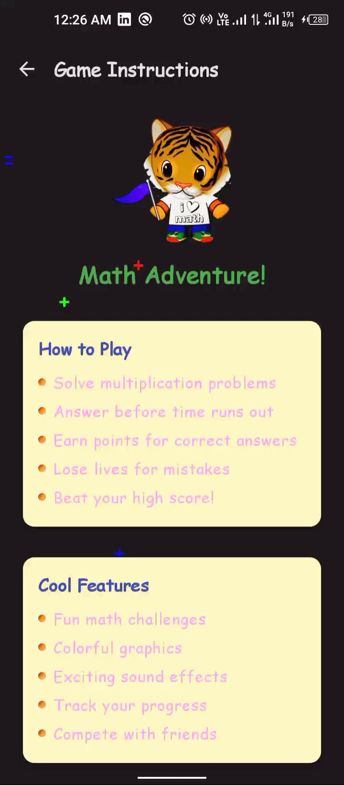
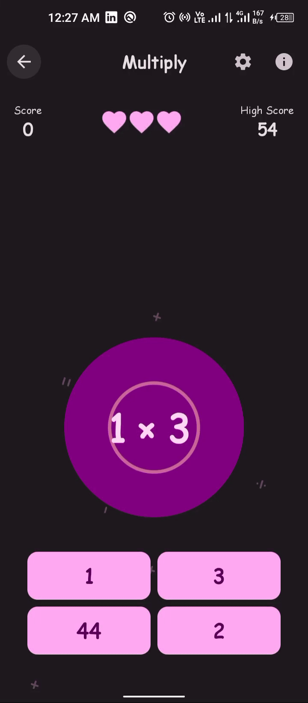
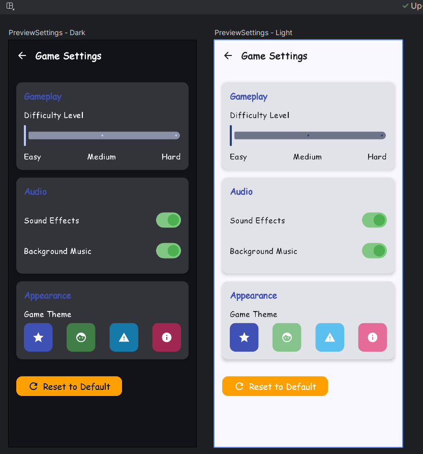

### Multiplication Training Game

This simple Android app to help kids improve their multiplication skills in a fun and interactive
way.

#### Overview

The game presents users with single-digit multiplication problems, and they must provide the correct
answer before the problem reaches the bottom of the screen. The user starts with three lives, and
each correct answer earns them one point. However, if the user fails to answer in time or provides
an incorrect answer, they lose a life.

#### Features

* Single-digit multiplication problems.
* Real-time feedback on correct and incorrect answers.
* Lives and points tracking.
* Game-over screen with the final score.
* Restart option to play again.

#### How to Play

* Type in the correct answer to the multiplication problem.
* Select The correct Answer from Choices before the problem reaches the bottom.
* Earn points for correct answers and lose lives for incorrect or slow responses.
* Try to achieve the highest score before running out of lives!

#### Technologies Used

* Android Studio
* Kotlin
* Jetpack Compose
* Installation
  Clone the repository:

```bash
git https://github.com/stephenWanjala/Multiply.git
```

<p>Open the project in Android Studio.</p>

Build and run the app on your Android device or emulator.

## Screenshots

| Welcome Screen                      | Game Instructions                            | GamePlay                        | GamePlay   GameOver                  | Game Settings                  |
|-------------------------------------|----------------------------------------------|---------------------------------|--------------------------------------|--------------------------------|
|  |  |  |  |  |

##### Acknowledgments

This app was created as a part of the Android development learning process and Helping My sibling
quickly grasp math. Feel free to contribute, provide feedback, or use it for educational purposes.

## License

This project is licensed under the MIT License - see the [LICENSE](LICENSE) file for details.