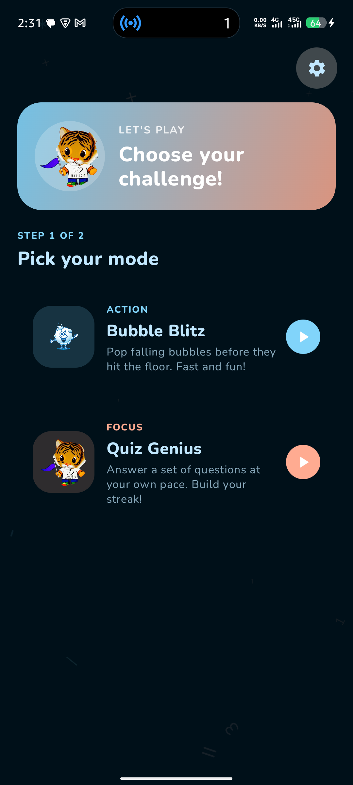
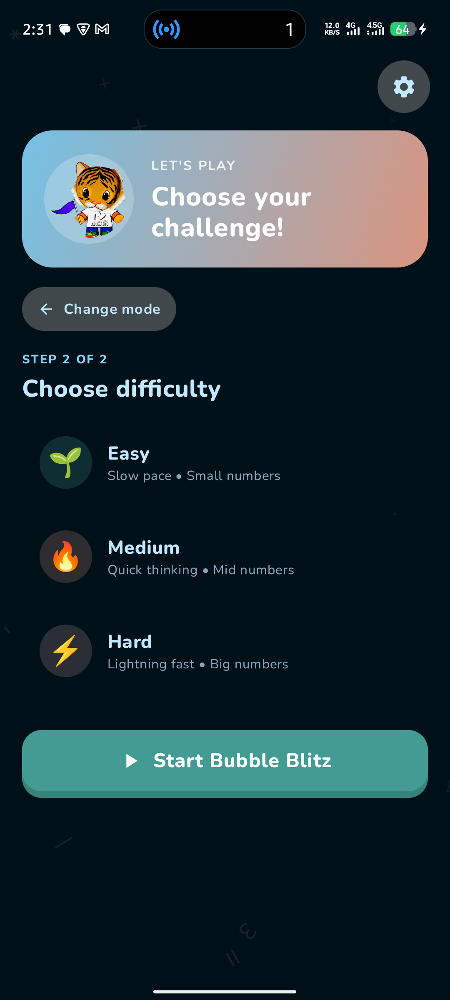
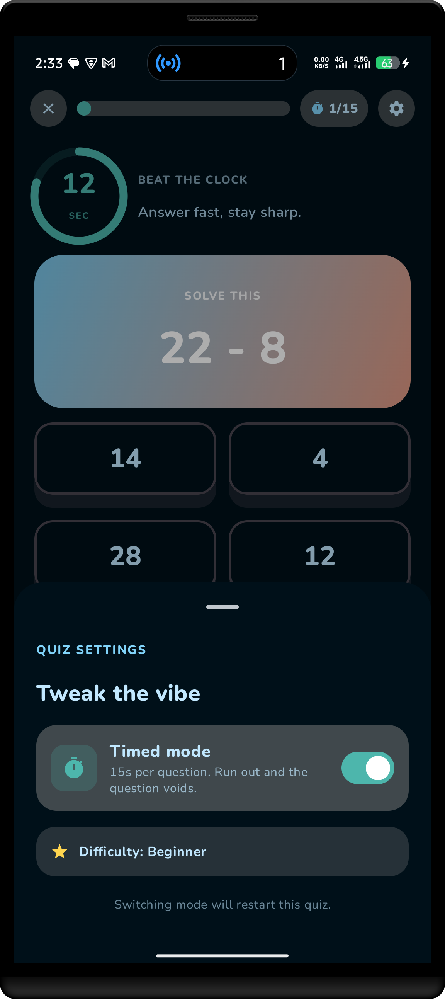
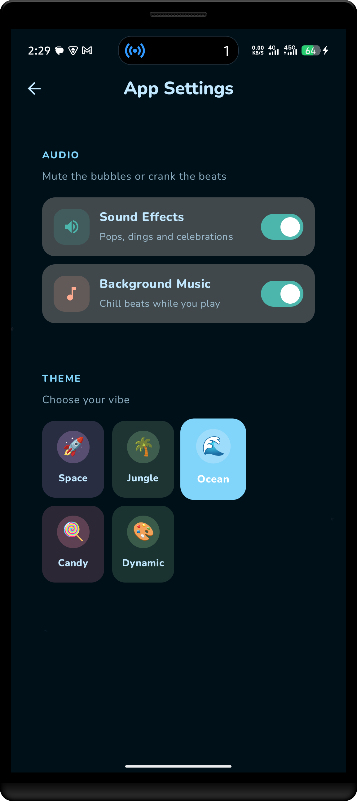

# Multiply — Math Training Game

A fun, animated Android app to help kids (and anyone brushing up on mental math) sharpen
arithmetic skills across addition, subtraction, multiplication, division, exponents and
modular arithmetic. Built with Jetpack Compose and Material 3.

## Game Modes

### 🫧 Bubble Math Blitz

Action mode. Math questions ride falling bubbles toward the bottom of the screen — tap the
bubble carrying the correct answer before the question bubble hits the floor.

- Three lives, one point per correct pop.
- Pause / resume, restart, home, and a game‑over screen with high‑score tracking.
- Three difficulty tiers: **Easy**, **Medium**, **Hard** — faster spawns and bigger numbers
  as you climb.
- High scores are saved per difficulty via DataStore.

### 🧠 Quiz Genius

Focus mode. Multiple‑choice questions across four tiers. **Timed mode is on by default**
for that adrenaline / game‑show vibe.

- **Four difficulties**, each with its own question count, number range, and per‑question
  time budget:
  - 🌱 Beginner — 15 questions, 1–20, 15s per question (addition / subtraction)
  - 🔥 Intermediate — 20 questions, 5–50, 12s per question (+ × ÷)
  - ⚡ Advanced — 25 questions, 10–100, 15s per question (× ÷ mod ^)
  - 💀 Expert — 30 questions, 1–200, 20s per question (compound / sequential expressions)
- **Timed mode (default on):**
  - A circular countdown ring pulses green → amber → red as the clock winds down.
  - Haptic buzzes in the final 3 seconds.
  - Selecting an answer locks it in, reveals the correct option, and auto‑advances.
  - If the timer elapses before you pick, the question is **voided** with a "TIME'S UP!"
    banner and the quiz moves on — you can't go back or change it.
  - A live streak pill shows consecutive correct answers.
- **Untimed mode:** traditional self‑paced flow with Back / Check / Finish buttons so you
  can revisit and change earlier answers.
- Toggle timed mode from the in‑quiz settings sheet (gear icon in the header). Switching
  mode restarts the current quiz. Opening the settings sheet pauses the countdown.
- **Recap screen** shows percentage, star tier (up to 3), per‑question review with
  separate badges for correct, wrong, and timed‑out answers, plus a confetti celebration
  at 70%+.

Distractor answers are generated with a "smart wrong answers" strategy (off‑by‑one,
doubling/halving mistakes, rounding errors) so the wrong options feel plausible rather
than random.

## How to Play

1. Pick a game mode on the home screen.
2. Choose a difficulty.
3. In **Bubble Blitz**, tap the bubble with the right answer before it reaches the floor.
   In **Quiz Genius**, tap the correct choice (before the clock runs out, if timed mode is
   on).
4. Finish the run and review your stats — then try to beat your best.

## Tech Stack

- **Kotlin** + **Jetpack Compose** (Material 3, adaptive layouts)
- **MVI‑style** state management with `ViewModel` + `StateFlow` + `Channel` effects
- **Koin** for dependency injection
- **DataStore** (Preferences) for persisting difficulty selections, high scores and the
  timed‑mode toggle
- **Navigation Compose** with type‑safe routes
- Compose animations / `Canvas` drawing for the timer ring, confetti, falling bubbles,
  and floating background symbols

## Getting Started

```bash
git clone https://github.com/stephenWanjala/Multiply.git
```

Open the project in Android Studio, let Gradle sync, then build and run on an Android
device or emulator (min SDK per `app/build.gradle.kts`).

To build from the command line:

```bash
./gradlew :app:assembleDebug
```

## Screenshots

| Pick Your Mode                       | Choose Difficulty                              | Quiz Genius (Timed)               | App Settings                          |
|--------------------------------------|------------------------------------------------|-----------------------------------|---------------------------------------|
|  |  |  |  |

## Acknowledgments

Originally built to help a younger sibling grasp arithmetic more playfully, and since grown
into a sandbox for exploring Compose animations and interaction design. Contributions,
feedback, and educational reuse are all welcome.

## License

This project is licensed under the MIT License — see the [LICENSE](LICENSE) file for
details.
